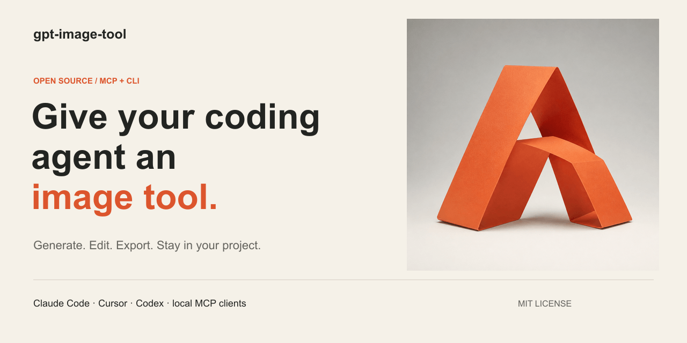
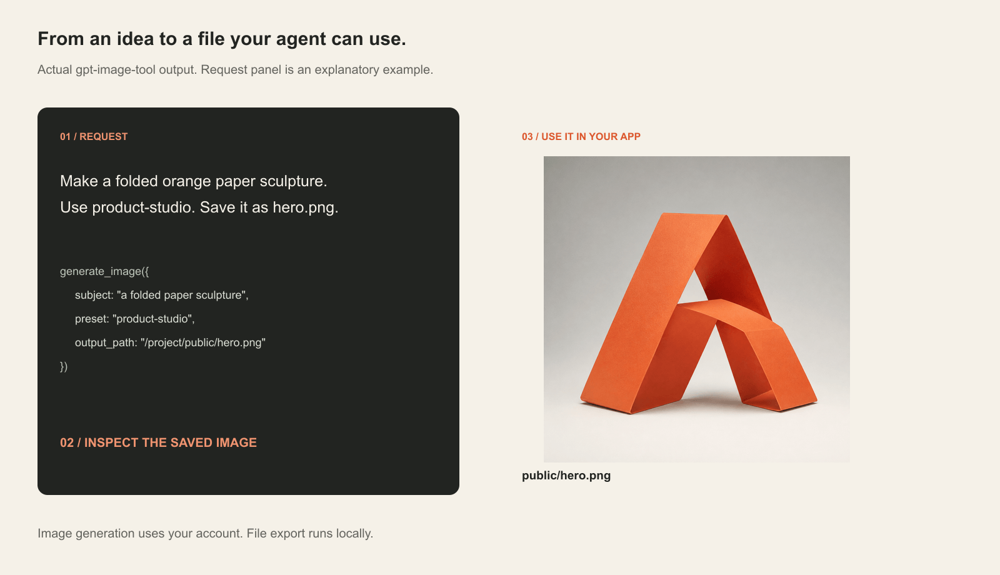

# gpt-image-tool



**Generate images where you write code.** An open-source MCP server and CLI for Claude Code, Cursor, Codex, and other agents that can run a local stdio MCP server.

Ask for a hero image, edit it, then export the sizes your app needs. The tool saves files into your project and returns their paths so your agent can inspect and use them.

[Quick start](#quick-start) · [Client setup](docs/SETUP.md) · [Examples](docs/EXAMPLES.md) · [Tool reference](docs/TOOLS.md) · [Troubleshooting](docs/TROUBLESHOOTING.md)

> **Subscription access is experimental.** The default backend reuses your local Codex ChatGPT login through an undocumented endpoint. It consumes account usage and may change or stop working. There is no separate image API bill on this path, but access is neither unlimited nor guaranteed. This is an independent project, not an official OpenAI integration. A separately billed OpenAI API backend is available when explicitly selected.

## See what it makes



The sculpture above was generated with this tool. The surrounding layout is an explanatory graphic, not a screenshot of a coding client. [Exact request and original output](docs/EXAMPLES.md).

## Quick start

You need **Node.js 22.18 or newer**, npm, Git, and, for the subscription backend, a ChatGPT login saved by Codex CLI in a local `auth.json` file. OS keychain credentials are not read by this tool. [Authentication and API-key setup](docs/SETUP.md).

```sh
git clone https://github.com/v2matosevic/gpt-image-tool.git
cd gpt-image-tool
npm ci
npm run build
codex login
node dist/cli.js --check
```

Already signed in to Codex with file-based credentials? Skip `codex login`. The check inspects your session and refreshes it if necessary; it does not generate an image or prove that your account has image access. Keep its account details out of public screenshots.

Connect Claude Code, replacing the path with your checkout's **absolute path**:

```sh
claude mcp add --scope user --transport stdio gpt-image -- node "/absolute/path/gpt-image-tool/dist/mcp.js"
```

Windows paths can use forward slashes, for example `C:/tools/gpt-image-tool/dist/mcp.js`. Reconnect the server or restart the client, then ask:

```text
Use gpt-image to make a warm orange paper sculpture for this app's hero.
Choose a suitable preset, save it to public/images/hero.png, inspect the
result, then add it to the page with descriptive alt text.
```

[Cursor, Codex, generic MCP, and API-key instructions →](docs/SETUP.md)

Prefer a terminal? Run:

```sh
node dist/cli.js --subject "a folded orange paper sculpture" --preset product-studio -o ./hero.png
```

Installation is from source. There is no official npm release of this project yet; do not assume a similarly named npm package belongs to this repository.

## What you can do

- Generate from a prompt or choose from **70 presets** and 23 modifiers.
- Edit with reference images, restyle, and use masks for targeted changes.
- Make related assets with style references, project brand profiles, and series.
- Export favicons, Open Graph cards, responsive hero images, and app icons locally.
- Create transparent cutouts, with a local keyer for clean backgrounds.
- Set exact text and real logos on generated plates; build social cards and carousels.

The ten MCP tools are `generate_image`, `edit_image`, `upscale_image`, `export_web_assets`, `remove_background`, `compose_overlay`, `create_social_card`, `create_social_carousel`, `strip_image_metadata`, and `list_image_presets`. [Every parameter →](docs/TOOLS.md)

## Keep a project's style consistent

Add a strict-JSON `.gptimage.json` to your project:

```json
{
  "preset": "product-studio",
  "style": {
    "color": "burnt orange, warm ivory, graphite",
    "avoid": ["text", "watermarks", "glossy plastic"]
  },
  "outputDir": "./public/images"
}
```

Use an absolute `output_path` in MCP calls so the tool can discover the intended project's profile. Add `styleReference` with a real local image when you want a visual anchor. Edits and upscales inherit operational defaults, not your generation style. [Profile reference](examples/README.md).

## Know the limits

- Subscription generation shares your account's usage. Batches and proof retries consume additional requests. The API backend is only used when selected; it has separate billing.
- This server reads and can refresh a local credential file. Treat it like other software with account access. It is designed for a trusted local agent, not as a public hosted service. [Data flow and security](SECURITY.md).
- Subscription transparency uses a chroma background and local removal. Fine hair, translucent edges, and matching colors can need cleanup.
- Upscaling regenerates the image. It can change details; it is not a lossless enlargement. Requested dimensions and text accuracy must be checked on the output.
- A proof loop is a model check, not a guarantee. `compose_overlay` uses real fonts for exact copy; inspect wrapping and glyph coverage.
- Images have EXIF/XMP/C2PA metadata removed by default. Set `GPT_IMAGE_KEEP_METADATA=1` to retain the returned model metadata. Generated examples here are explicitly identified as AI-generated.
- `sharp` supplies text rendering and additional image formats. The documented `npm ci` installs it; a production-only dependency install does not.

## Documentation and contributing

[Setup](docs/SETUP.md) · [Examples](docs/EXAMPLES.md) · [Agent playbook](docs/AGENTS.md) · [Presets](docs/PRESETS.md) · [Architecture](docs/ARCHITECTURE.md) · [Contributing](CONTRIBUTING.md) · [Security](SECURITY.md) · [Changelog](CHANGELOG.md)

```sh
npm test
npm run smoke:mcp
```

Tests and the MCP smoke check run locally without credentials or image quota. Live provider access is checked separately and can vary by account. [Report a reproducible problem](https://github.com/v2matosevic/gpt-image-tool/issues/new/choose) or contribute a focused improvement.

Created by [Marko Matosevic](https://github.com/v2matosevic). Code is licensed under [MIT](LICENSE). Generated image examples are labeled in [the asset manifest](docs/assets/README.md); OpenAI and client product names belong to their respective owners.
