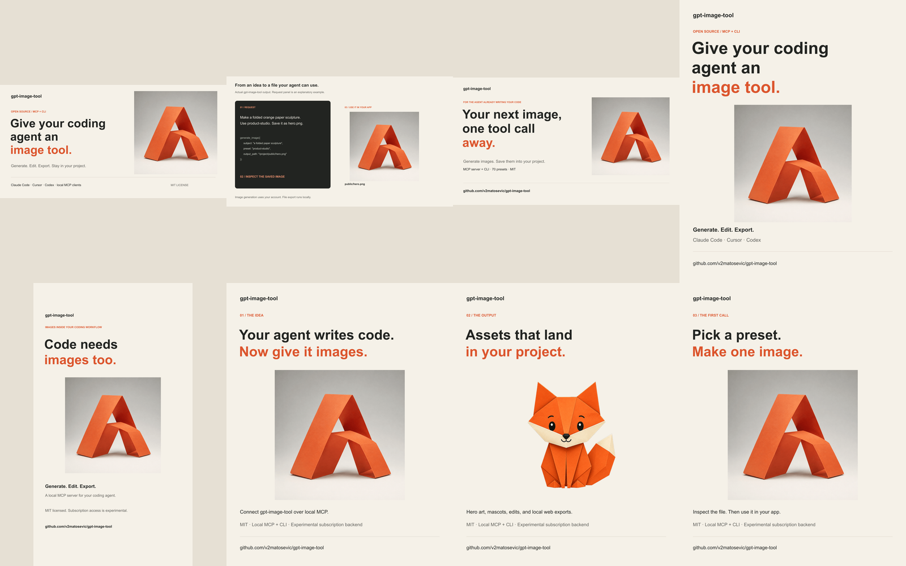

# Launch kit

The launch message: **Give your coding agent an image tool.** Lead with a real output, then the coding workflow, then the repository link.

Repository: https://github.com/v2matosevic/gpt-image-tool



## Ready-to-use files

| File | Size | Use |
|---|---|---|
| [x-landscape.png](x-landscape.png) | 1600×900 | X or a landscape announcement |
| [linkedin-portrait.png](linkedin-portrait.png) | 1080×1350 | LinkedIn or Instagram feed |
| [story.png](story.png) | 1080×1920 | Story with a repository link sticker |
| [carousel-1.png](carousel-1.png), [carousel-2.png](carousel-2.png), [carousel-3.png](carousel-3.png) | 1080×1350 each | Upload in numbered order |
| [../assets/github-banner.png](../assets/github-banner.png) | 1280×640 | GitHub social preview |

[Alt text for each post image](alt-text.json). Add it when uploading. These are export dimensions, not a guarantee of any platform's current crop behavior. Preview the post in its composer before publishing.

## X announcement

```text
I open-sourced gpt-image-tool: generate, edit, and export images inside your coding agent via MCP.

Claude Code, Cursor, Codex. MIT licensed.

Subscription access is experimental; account limits apply.

https://github.com/v2matosevic/gpt-image-tool
```

Use `x-landscape.png`. The copy is designed for a standard short post with a shortened link; check the composer count before submitting.

## LinkedIn announcement

```text
Your coding agent can build the page. Now give it an image tool.

I open-sourced gpt-image-tool, a local MCP server and CLI that lets an agent generate an image, save it into your project, inspect it, and keep building.

It includes 70 style presets, image editing, project brand profiles, transparent cutouts, and local exports for favicons, hero images, and social cards. It connects to Claude Code, Cursor, Codex, and other local MCP clients.

The images in this post were made with the tool itself.

The default backend reuses a local Codex ChatGPT login. It uses your account allowance through an undocumented endpoint, so access is experimental and may change. An explicitly selected, separately billed OpenAI API backend is also available.

The source is MIT licensed, with setup instructions and copyable workflows. Try it on one asset in your next project. Installation feedback and reproducible issues are welcome.

https://github.com/v2matosevic/gpt-image-tool
```

Use `linkedin-portrait.png` or the three carousel images where the composer supports image sequences. For a document carousel, export the three slides to a PDF before uploading; these deliverables are PNGs.

## Instagram caption

```text
Code needs images too.

I open-sourced gpt-image-tool so a coding agent can generate, edit, and export images directly into a project. These paper-sculpture and mascot examples were made with the tool.

Local MCP + CLI. 70 presets. MIT licensed.

Subscription access is experimental and uses account limits. A separate paid API backend is optional.

github.com/v2matosevic/gpt-image-tool

#ClaudeCode #MCP #OpenSource #WebDevelopment
```

Use the three carousel PNGs. Put the GitHub URL in your profile or a story link sticker; plain caption links may not be clickable.

## Developer-community post

Title: `I built an MCP image toolkit for coding agents: generation, edits, and local web exports`

```text
I'm sharing gpt-image-tool, an MIT-licensed local MCP server and CLI.

The workflow is straightforward: ask your coding agent for an asset, generate it into the project, inspect the file, then use it in the app. It has 70 presets, reference-image editing, project style profiles, and local export recipes for favicons, social previews, and responsive hero images.

One important limitation: the default subscription backend reuses Codex's file-based ChatGPT credentials through an undocumented endpoint. It consumes account usage and can break if upstream behavior changes. The separate OpenAI API backend requires explicit selection and has API billing.

The repo has setup instructions, actual generated examples with their prompts, and offline tests. I'd particularly value reproducible installation reports from different local MCP clients.

https://github.com/v2matosevic/gpt-image-tool
```

Check a community's current self-promotion rules before submitting. Identify yourself as the maintainer. No accounts have been messaged and no social posts have been submitted by this preparation work.

## A short demo recording

Aim for 30–45 seconds of edited footage. This is a shot list, not an existing recording:

1. Show the coding agent and a project with a real empty asset slot.
2. Type a prompt from [EXAMPLES.md](../EXAMPLES.md).
3. Show the actual `generate_image` call. Trim waiting time and label the cut, since generation can take minutes.
4. Open the saved image and show it in the page.
5. End on the repository URL and the experimental subscription caveat.

Use a clean demo project. Hide account identifiers and local private paths. Never show `auth.json` or health-check account output. Do not stage a fabricated client transcript as live footage.

## Publish sequence

1. Confirm the public repository and quick start work from a signed-out view.
2. Post the announcement with one strong image. Put the repo link in the post.
3. Follow with one concrete workflow example when you have a new result to show.
4. Respond to installation reports and turn reproducible failures into issues.

Keep messaging factual: no unlimited/free-image claims, no official endorsement, no unmeasured speed claims. Review GitHub traffic, clones, stars, and installation issues after launch. These are signals, not proof of active usage. Keep all social posting manual until the maintainer chooses the accounts and timing.

## GitHub social preview

In repository Settings, General, Social preview, upload `docs/assets/github-banner.png`. The README already uses the same image. This setting requires an authenticated repository-owner session.

## Rebuild

`npm run assets:launch` regenerates the layouts from the committed samples without using image quota. Full image-generation prompts and provenance are in [the asset manifest](../assets/README.md).
